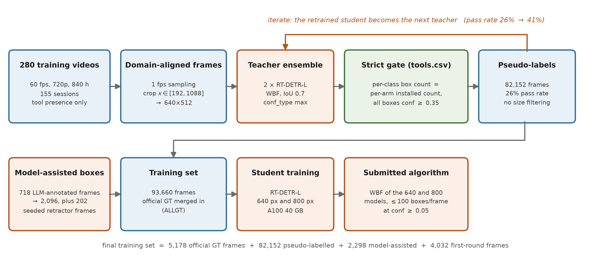

# MICCAI 2026 SurgVU Challenge — Team APC_TDC

Code and method report for team **APC_TDC** (Grand Challenge user `seantangth`) in the
[SurgVU 2026 challenge](https://surgvu26.grand-challenge.org/) at MICCAI 2026.
We entered both categories.

| Category | Task | Metric | Our final score |
|---|---|---|---|
| 1 | Weakly supervised surgical tool detection | mAP@[.5:.95], averaged per video | **0.4930** |
| 2 | Surgical video question answering | BERTScore-F1 | **0.6191** |

The full method description is in [`report/main.pdf`](report/main.pdf).

## The one-sentence finding

On Category 1 the dominant lever is the **scale and scale-diversity of pseudo-labelled
training data**, not the architecture or the training recipe. Every recipe change we tried
moved the official score by at most 0.006; growing the pseudo-label source from 20 to 280
videos moved it by **+0.052**.

## Results and ablations

Official Grand Challenge scores:

| Phase | Configuration | Score |
|---|---|---|
| C1 Preliminary | official validation videos only (5,178 frames) | 0.4372 |
| C1 Preliminary | domain-aligned strict pseudo-labels (7,281 frames) | 0.4464 |
| C1 Preliminary | pseudo-label source 20 → 280 videos (93,660 frames) | 0.5059 |
| C1 Final | single model, 640 px | 0.4830 |
| C1 Final | + separate model for the four zero-AP classes | 0.4833 |
| C1 Final | + WBF of the 640 and 800 px models | **0.4930** |
| C2 Final | echo templates | 0.5833 |
| C2 Final | + question-type routing fix | 0.6067 |
| C2 Final | + visual yes/no polarity | **0.6191** |

Paired ablations against a student hold-out (official validation videos 1 and 7 excluded
from the student, official evaluation protocol):

| Change | mean mAP | AP50 | AP75 |
|---|---|---|---|
| 800 px training vs 640 px, same data | +0.0131 | +0.0050 | +0.0275 |
| Cross-model WBF vs single model | +0.0166 | +0.0067 | +0.0376 |
| OCR-gated relabelling vs strict count gate | −0.0127 | −0.0066 | −0.0086 |

Both positive gains sit almost entirely at high IoU: they tighten boxes rather than find
more tools. **Caveat:** these ablations isolate the student, not the whole pipeline. The
teacher that produced the pseudo-labels had seen the held-out videos, so the absolute values
are optimistic and only the paired differences should be read.

### What did not work

Recorded here so others do not spend compute on it.

| Attempt | Result |
|---|---|
| 39 inference-time variants (TTA, conf sweep, top-k, multi-scale, NMS variants) | ceiling +0.005 |
| Ten temporal post-processing variants (score/box smoothing, gap filling) | −0.004 to −0.06 |
| Single-model self-merge of duplicate queries | +0.0018 AP75 |
| Shrinking predicted boxes to correct a size bias | monotonically worse |
| Training on official ground truth only | mean 0.4024 vs 0.5905 mixed |
| Fine-tuning a mixed-trained model on ground truth only | ND AP75 0.51 → 0.36 |
| Frame-level pseudo-label "cleaning" with a P2–P98 box-size filter | worse across the board |
| Elimination-based class assignment for undetected classes | 0–35% IoU≥0.5 hit rate |

## Repository layout

```
category1/
  data_pipeline/   frame extraction, weak labels, pseudo-labelling, model-assisted annotation
  training/        training recipe and the Lambda Cloud job scripts that ran it
  evaluation/      official-protocol evaluator, AP-by-IoU, ensembling and hold-out probes
  container/       the submitted Grand Challenge algorithm container
category2/
  container/       the submitted Grand Challenge algorithm container (rule-based)
report/            LaTeX method report (main.pdf), 3-minute presentation
                   (APC_TDC_presentation.pptx, narration in the speaker notes)
```

Scripts that used to hold an absolute path now read `SURGVU_ROOT` from the environment and
fall back to the current directory:

```bash
export SURGVU_ROOT=/path/to/your/working/copy
```

## Category 1 method



**Domain alignment.** The public validation frames are 640×512 crops of the 1280×720
endoscope feed. `data_pipeline/crop_to_test_domain.py` and `extract_scale.py` reproduce that
transform on training frames (crop `x ∈ [192, 1088]` at full height, resize to 640×512) so
that pseudo-labelling, training and inference all share one geometry.

**Weak labels.** `data_pipeline/weak_labels_scale.py` parses `tools.csv` per robot arm into
the multiset of tools installed at every second, resolving overlaps on one arm in favour of
the shorter interval and expanding labels across video parts.

**Pseudo-labelling.** `data_pipeline/pseudo_label_scale.py` runs a teacher ensemble of two
RT-DETR-L models, fuses their predictions with weighted box fusion (IoU 0.7, `conf_type=max`),
and then applies:

- keep boxes with confidence ≥ 0.20 whose class is in the installed multiset;
- drop boxes centred in the da Vinci interface banners (`cy < 34` or `cy > 470` in the
  512-pixel frame);
- drop whole frames where two different classes share a box (IoU > 0.7);
- accept the frame only if the per-class box count equals the installed count **exactly** and
  every kept box has confidence ≥ 0.35.

There is deliberately **no box-size filter**. An earlier variant that clipped box areas to the
2nd–98th percentile removed exactly the near- and far-field scale samples the detector needs
and measurably reduced AP75.

**Iteration.** Retraining the teacher on its own accepted output raised the acceptance rate
from 26% to 41% and the pool from 82k to 142k frames. Iterative pseudo-labelling converges
here because `tools.csv` is an external, model-independent filter.

**Background collapse.** Prograsp forceps, stapler and tip-up grasper were initially dropped
from the pseudo-label targets while their images were kept, which taught the detector to treat
visible instances as background: 65,182 of 149,569 frames listed one of them as installed but
carried no box, against 711 positive prograsp boxes. Deleting those contradictory frames
raised held-out detection of prograsp and stapler from 0.000 to 0.255 and 0.265.
**If you build a pipeline like this, print the per-class positive box count and the count of
"installed but unlabelled" frames before every training run.**

## Reproducing the training

Environment (as used on the training host):

```bash
python3 -m venv venv && source venv/bin/activate
pip install torch torchvision --index-url https://download.pytorch.org/whl/cu128
pip install "ultralytics==8.4.137"    # pinned: RT-DETR postprocess semantics change between versions
```

Stages, in order:

1. **Extract frames** — `category1/data_pipeline/extract_scale.py` streams each official video
   with `remotezip`, samples a 15-second window every 180 seconds (denser during intervals
   where a rare tool is installed), decodes at 1 fps, applies the domain crop, and deletes the
   video. 260 videos → 377,388 frames.
2. **Weak labels** — `weak_labels_scale.py` over `tools.csv`.
3. **Pseudo-labels** — `pseudo_label_scale.py <frames> <weak.json> <out> <teacher1.pt> [teacher2.pt]`.
4. **Model-assisted boxes** for the three never-detected classes — `opus_candidates.py`,
   `opus_postprocess.py`, `opus2_batches.py` (see disclosure below).
5. **Train** — `category1/training/train_v5.sh`, driven by environment variables. The two
   submitted models:

   ```bash
   RUN_TAG=v7_rA2      IMGSZ=640 BATCH=24 EPOCHS=16 CLOSE_MOSAIC=6 ALLGT=1 bash train_v5.sh
   RUN_TAG=v12_rA2_800 IMGSZ=800 BATCH=20 EPOCHS=16 CLOSE_MOSAIC=6 ALLGT=1 bash train_v5.sh
   ```

   `category1/training/job_v12_rA2_800.sh` is the exact self-contained job that produced the
   800-pixel model, including the save-before-shutdown guard.

Training used one NVIDIA A100 SXM4 40 GB on Lambda Cloud: 5.8 h at 640 px, 8.0 h at 800 px.

**Recipe warning.** Ultralytics silently switches `optimizer=auto` to MuSGD at lr 0.01 once
iterations exceed 10,000, so the recipe changes under you as the dataset grows. We set the
optimizer explicitly: AdamW, `lr0=0.000556`, `lrf=0.01`, `momentum=0.9`,
`weight_decay=0.0005`, and `warmup_bias_lr=0` (omitting the last one drives the bias group's
warmup learning rate to 0.067 and wrecks the first epochs).

`ALLGT=1` merges the official annotated validation videos into training, so the reported
validation numbers of the submitted models are memorisation scores. Use `last.pt`, not
`best.pt`, for those runs.

## Reproducing the submitted container

```bash
cd category1/container
docker build --platform=linux/amd64 -f Dockerfile.v7 -t surgvu26-cat1 .
bash do_test_run.sh          # runs the container over the sample input
```

The container reads weights from the Grand Challenge algorithm-model mount at
`/opt/ml/model`. A `routing.json` in that tarball assigns classes and an inference resolution
to each model:

```json
{"groups": [
  {"weights": ["a_rA2.pt", "b_rA2_800.pt@800"],
   "classes": ["needle_driver", "monopolar_curved_scissor", "..."]}
]}
```

Members of a group are fused with WBF; `name.pt@800` overrides that member's inference
resolution, which is required because the 800-pixel model must be run at 800. Without a
`routing.json` the container falls back to fusing every weight over all classes. Output is
capped at 100 boxes per frame at confidence ≥ 0.05 with true confidence values, and a
wall-clock guard falls back to a single model if the projected runtime would exceed the
per-case limit.

Model weights are attached to the
[v1.0-final release](https://github.com/seantangth/miccai2026-surgvu-surgical-tool-detection-vqa/releases/tag/v1.0-final):
`cat1-final-model.tar.gz` is the exact algorithm-model tarball we submitted (it extracts to
`/opt/ml/model`), and the two `.pt` files are also provided individually. The same weights are
bound to the Grand Challenge algorithm, for which the organizers have editor access.

## Category 2 method

`category2/container/inference_v05.py` is rule-based, with no generative model. BERTScore
against short reference answers rewards matching the expected answer *form*, so we classify
each question into one of six types from the position of its auxiliary verb and wh-word and
emit a templated sentence. Yes/no polarity for five tools with high detector recall is decided
visually by the Category 1 detector over 15 sampled frames (confidence 0.35, at least 4
frames); the remaining tools fall back to a prior estimated from 30-second windows of
`tools.csv`.

The single largest gain came from fixing the router, not from the vision: 16 of 101 Final
cases were answering a different question type than the one asked, worth +0.023 once fixed.

## Disclosure

Required by the challenge rules.

- **No external datasets** were used. The detector starts from the COCO-pretrained
  `rtdetr-l.pt` shipped by Ultralytics.
- **Model-assisted annotation.** Bounding boxes for the three never-detected classes
  (stapler, tip-up fenestrated grasper, prograsp forceps) were annotated with a large language
  model (Claude Opus 5) on 718 frames and expanded to 2,298 training frames by
  template-matching propagation, i.e. 2.5% of the training set. The prompting protocol,
  acceptance thresholds and propagation code are in `category1/data_pipeline/opus*.py`. Quality
  was checked by visual sampling only; there is no ground truth for these classes in the
  official validation set. The annotation files themselves are available to the organizers on
  request.
- **EasyOCR 1.7.2** (Apache-2.0) was used in an explored variant to read instrument names from
  the da Vinci interface as a training-time pseudo-label gate. That variant scored −0.0127 in a
  controlled comparison and **is not part of the submitted model**; the inference container
  never reads the interface.

## Citation

```bibtex
@misc{APC_TDC_surgvu2026,
  title  = {SurgVU Challenge 2026 --- Team APC\_TDC},
  author = {Tang, Tze-Hsiang},
  year   = {2026},
  note   = {MICCAI 2026 EndoVis SurgVU Challenge},
  url    = {https://github.com/seantangth/miccai2026-surgvu-surgical-tool-detection-vqa}
}
```

## License

MIT for the code in this repository. The challenge dataset is governed by the SurgVU 2026
challenge terms and is not redistributed here.
